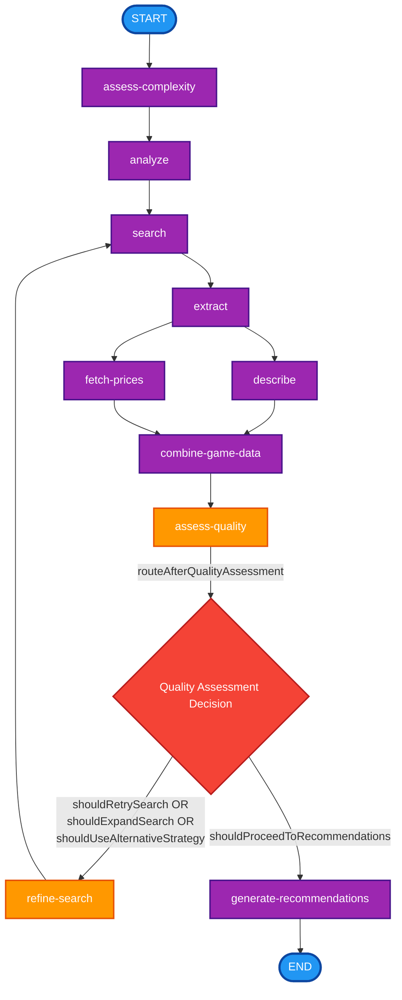

# Game Recommendation Graph Diagram

This diagram shows the flow of the game recommendation agent graph, including all nodes and their connections.

## Node Descriptions

### Core Processing Nodes

- **assess-complexity**: Evaluates the complexity of the user's query
- **analyze**: Analyzes the user request to understand requirements
- **search**: Searches for games using external APIs
- **extract**: Extracts relevant game data from search results
- **describe**: Fetches detailed descriptions for games
- **fetch-prices**: Retrieves pricing information for games
- **combine-game-data**: Combines all collected game information
- **generate-recommendations**: Creates final game recommendations

### Agentic Decision Nodes

- **assess-quality**: Evaluates the quality of search results and game data
- **refine-search**: Refines search parameters based on quality assessment

### Decision Logic

The graph includes one main conditional routing point:

1. **After Quality Assessment** (`routeAfterQualityAssessment`): Routes based on:
   - **To refine-search** if any of these conditions are true:
     - `shouldRetrySearch`: Need to retry with different parameters
     - `shouldExpandSearch`: Need to expand search scope
     - `shouldUseAlternativeStrategy`: Need to try alternative search strategy
   - **To recommend** if:
     - Quality is good/excellent, OR
     - Has minimum games (≥2) and exhausted retries (≥2)

### Flow Patterns

- **Linear Flow**: START → assess-complexity → analyze → search → extract → (describe + price) → combine → assess-quality
- **Feedback Loop**: assess-quality → refine-search → search (allows iterative improvement)
- **Parallel Processing**: extract triggers both describe and price nodes simultaneously
- **Convergence**: Both describe and price feed into combine
